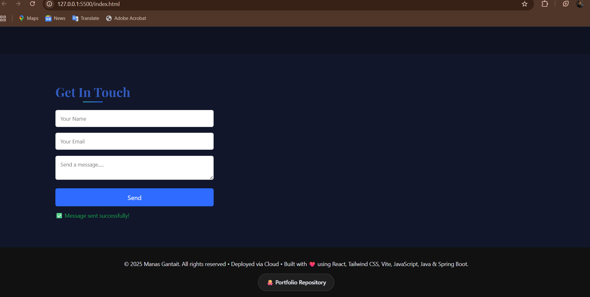

# 🚀 Manas Gantait — Software, Cloud & DevOps Engineering Portfolio

This repository represents my work across **software engineering, cloud architecture, DevOps automation, and full-stack development** ☁️🌐.  
It focuses on building **reliable backend systems**, **automated cloud infrastructure**, and **end-to-end applications**, following real-world engineering practices rather than theoretical examples.

---

## 👤 About Me

I am a **final-year B.Tech Computer Science student (2026)** with hands-on experience spanning **Java backend development**, **cloud-native system design**, **DevOps automation**, and **full-stack application workflows** 💻🔧.  
My work reflects how production systems are **designed, deployed, monitored, and evolved** across cloud environments.  

I actively work as:
- ☕ **Java Developer** — backend services, APIs, and system logic
- 🌐 **Full-Stack Developer** — integrating backend systems with usable frontends
- ☁️ **Cloud Engineer / Cloud Architect (Entry-Level)** — designing and deploying scalable cloud resources
- 🔁 **DevOps Engineer** — automating builds, deployments, and infrastructure workflows

---

## 🧩 What This Portfolio Shows 

This repository includes:
- 📸 **Screenshots of frontend interfaces** (UI, dashboards, user flows)
- 🧠 **Backend and API execution views** (request handling, logic flow)
- ☁️ **Cloud and DevOps workflows** (infrastructure setup, automation pipelines)
- 🌐 **Portfolio visuals** demonstrating application integration and system behavior

Each artifact is meant to show **how systems work together**, not just isolated features.

---

## 🛠 Technical Skills

### ☕ Programming & Backend
Java, Python, JavaScript, SQL  
Spring Boot, RESTful APIs, Event-Driven Architecture

### 🌐 Frontend
React.js, HTML, CSS

### ☁️ Cloud Platforms
AWS, GCP, Azure

### 🔁 DevOps & Infrastructure
Terraform, CloudFormation, Docker, Kubernetes, CI/CD (GitHub Actions)

### 🧩 Distributed Systems
Microservices, Scalability, Fault Tolerance, System Design

### 🧪 Testing & Quality
Unit Testing, Automated Testing, Code Reviews, Secure Coding Practices

### 📊 Monitoring & Observability
CloudWatch, Prometheus, Grafana

---

## 🧠 Engineering Approach 

Across my work, I consistently prioritize:
- 🧱 Clear separation of concerns
- 🤖 Automation over manual processes
- 🔍 Observability and reliability as first-class concerns
- ⚖️ Practical trade-off analysis instead of over-engineering

The goal is always to build systems that are **understandable, operable, and dependable**.

---

## 📌 Repository Structure

This repository contains:
- 📂 Organized folders for frontend, backend, and infrastructure artifacts
- 

- 🖼️ Visual screenshots to demonstrate functionality and workflows
- 
-  

# Portfolio Website

A production-ready personal portfolio demonstrating frontend engineering, backend integration, and real-world deployment practices.

---

## Tech Stack Used 🌐

| Layer | Technology | Purpose |
|-----|-----------|---------|
| Frontend | HTML5 | Page structure & content |
| Styling | CSS3 (Custom) | Layout, animations, theming |
| Scripting | JavaScript (Vanilla) | UI logic, API calls |
| Backend | Java + Spring Boot | REST APIs, contact email handling |
| API Style | REST (JSON) | Frontend ↔ Backend communication |
| Email Service | Gmail SMTP (Spring Mail) | Contact form email delivery |
| Build Tool | Maven | Dependency & build management |
| Secrets Management | Environment Variables | Secure credential handling |
| Hosting (Frontend) | **Netlify** | Static hosting with CDN |
| Version Control | Git, GitHub | Source code management |

---

## Hosting Details
- Frontend is deployed as a static site on **Netlify**
- Backend runs independently and is consumed via REST APIs
- Environment variables are used for secure configuration

---

## Key Highlights
- Real frontend → backend integration
- Secure contact form with email delivery
- Cloud-ready, decoupled architecture
- No hardcoded secrets or credentials
---

## 📫 Contact

- 📧 **Email:** imgantait@gmail.com  
- 💼 **LinkedIn:** https://linkedin.com/in/me-m-gantait  
- 🧑‍💻 **GitHub:** https://github.com/immanas 
- 🌍 **Portfolio:**  https://code-with-manas.netlify.app/

---

## 📄 License

This repository is shared for **learning, evaluation, and professional review**.  
All materials are provided for educational and demonstration purposes.
